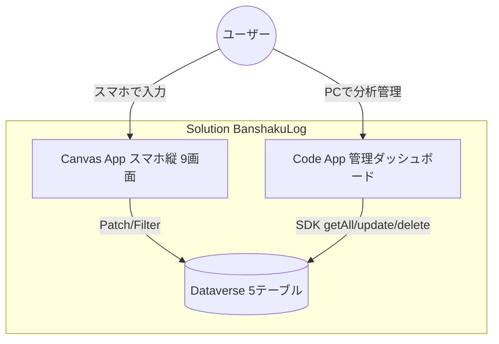
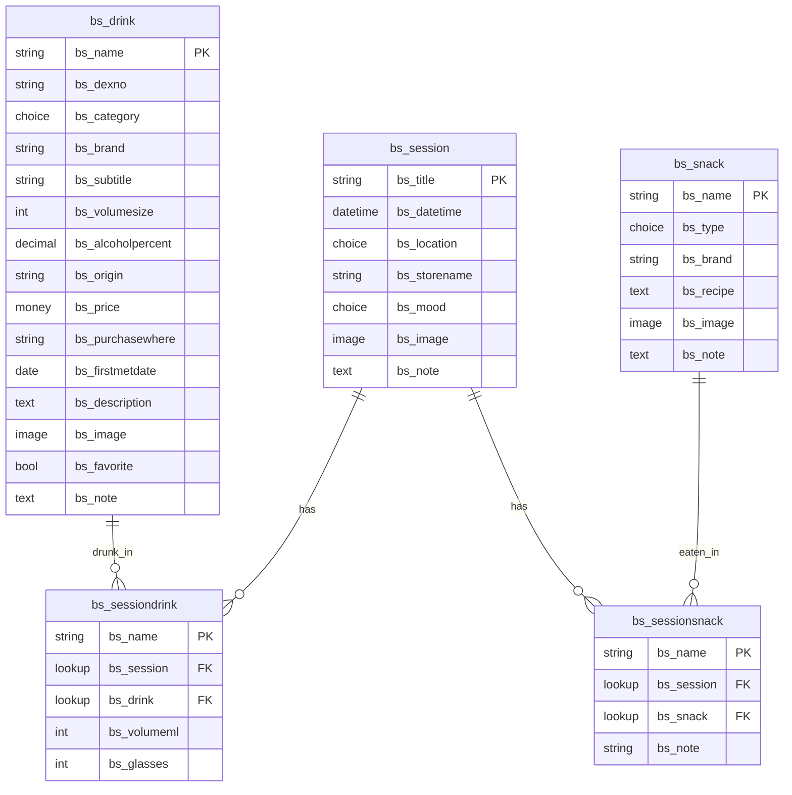
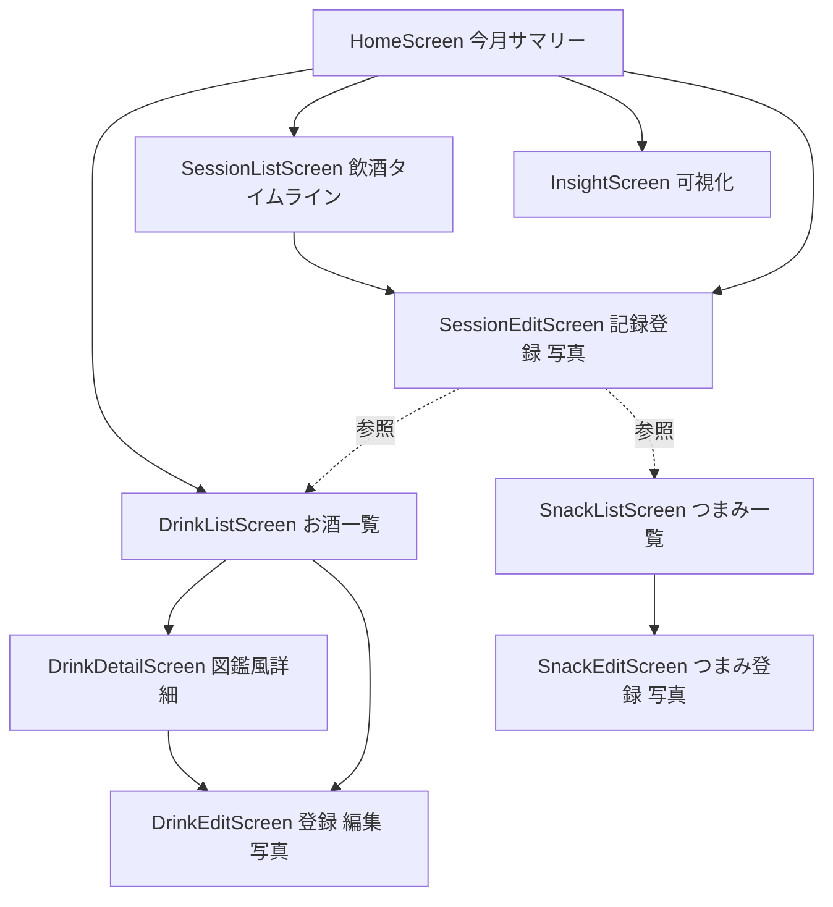
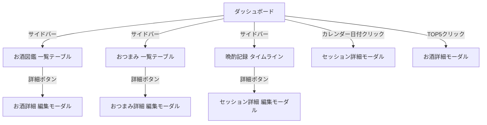
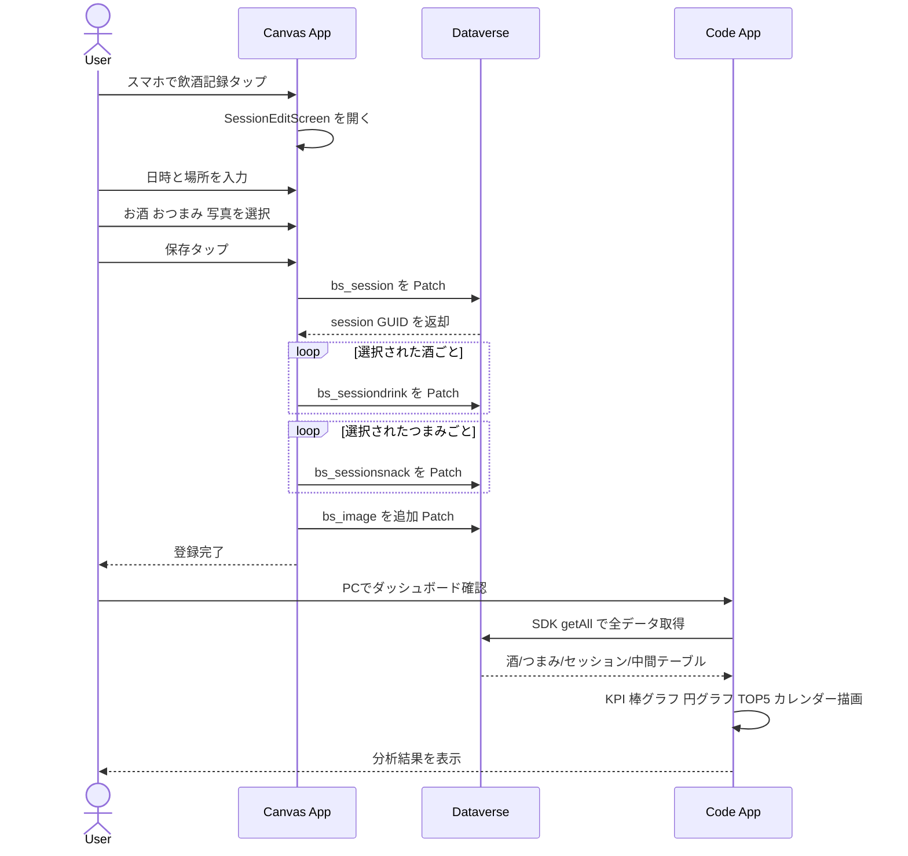

# ARCHITECTURE.md — 晩酌録 / BanshakuLog

## 1. システム全体構成図



## 2. ER 図（Dataverse 5 テーブル）



## 3. Canvas App 画面フロー（スマホ縦 9 画面）



## 4. Code App 画面構成（PC/タブレット 4 ページ）



### ダッシュボード レイアウト

```
┌──────────────────────────────────────────────────┐
│ [ダッシュボード]            2025年11月 〜 2026年5月 │
├──────────┬──────────┬──────────┬──────────────────┤
│ 飲酒日数  │ 合計杯数  │ 月平均   │ 年間換算         │
├──────────┴──────────┴──────────┴──────────────────┤
│ ┌──────────────────┐  ┌──────────────────────────┐│
│ │ カレンダーヒートマップ │  │ 月別杯数 棒グラフ        ││
│ │ (月ナビ/日クリック)  │  │ (X軸2段 月+年)          ││
│ └──────────────────┘  └──────────────────────────┘│
│ ┌──────────────────┐  ┌──────────────────────────┐│
│ │ 酒種別割合 円グラフ  │  │ よく飲む酒 TOP5          ││
│ │ (12時から大きい順)  │  │ (クリックで詳細モーダル)    ││
│ └──────────────────┘  └──────────────────────────┘│
└──────────────────────────────────────────────────┘
```

## 5. シーケンス図（晩酌記録の登録フロー）



## 6. 配色トークン（Canvas App + Code App 共通）

| トークン | 値 | 用途 |
|---|---|---|
| appBg / surface | `#FFFFFF` | 通常画面背景 |
| appAccent / amber-accent | `#C68642` | 琥珀色アクセント |
| appAccentSoft / amber-soft | `#E8C896` | 琥珀の薄め ヘッダー帯 |
| appText / ink | `#202020` | 標準文字色 |
| muted | `#8E8E93` | 補助テキスト |
| dexFrame / amber-deep | `#8B4513` | 図鑑外枠 カートリッジ茶 |
| dexBg | `#FCE4E4` | 図鑑内側 薄ピンク |
| surface-dim | `#F8F7F4` | ページ背景（Code App） |

## 7. データソース

| 種別 | 名前 | 用途 |
|---|---|---|
| Dataverse | bs_drinks / bs_snacks / bs_sessions / bs_sessiondrinks / bs_sessionsnacks | 全データ |
| Connector | なし | Power Automate 通知は将来検討 |

## 8. 技術スタック

### Canvas App
- Power Apps Canvas App（スマホ縦）
- MCP (canvas-authoring) 経由で YAML 編集
- AddMedia + Image コントロールで写真登録
- Patch 2段階（本体 → 画像 `{Value: ImgPreview.Image}`）

### Code App
| レイヤー | 技術 |
|---|---|
| UI | React 19 + TypeScript 6 |
| スタイリング | Tailwind CSS v4 |
| チャート | Recharts 2 |
| データフェッチ | TanStack React Query 5 |
| ルーティング | React Router 7 (HashRouter) |
| アイコン | lucide-react |
| ビルド | Vite 8 |
| Dataverse 通信 | @microsoft/power-apps SDK 自動生成サービス |
| デプロイ | pac code push |
