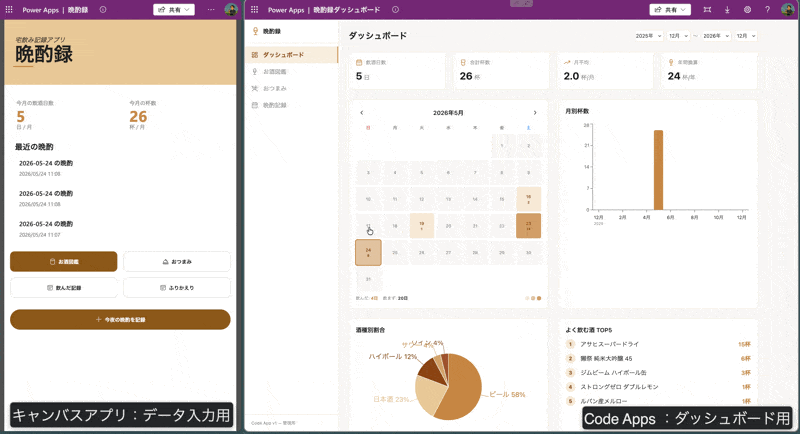

このGIF画像をリネームして、ReadMeの中に貼っておいてほしい。# 晩酌録 / BanshakuLog

自分の晩酌を「お酒図鑑」として記録・可視化する Power Apps ソリューションです。

スマホのキャンバスアプリでお酒・おつまみ・晩酌セッションを記録し、PC の Code Apps で飲酒傾向を分析できます。

## 主な機能

### キャンバスアプリ（スマホ）

- **お酒図鑑** — 銘柄・度数・容量・産地・写真を図鑑形式で登録
- **おつまみ管理** — 市販品 / 自作レシピを写真付きで記録
- **晩酌セッション** — 宅飲み・外飲みの記録に、飲んだお酒とおつまみを紐付け
- **可視化** — 月別グラフ・カレンダーヒートマップ・酒種別円グラフ・よく飲む酒 TOP5

### Code Apps（PC）

- **KPI カード** — 飲酒日数・合計杯数・月平均・年間換算
- **カレンダーヒートマップ** — 月ナビ付き、杯数で色分け
- **月別棒グラフ / 酒種別円グラフ / TOP5 ランキング**
- **お酒・おつまみ・晩酌記録のテーブル一覧** — 検索・ソート・編集・削除

## 前提条件

| 項目 | 内容 |
|---|---|
| ライセンス | Power Apps Premium / Per App Plan / 開発者環境 のいずれか |
| Dataverse | 必須（ソリューションに 5 テーブルが含まれます） |
| Code Apps | 環境で Code Apps（code-first）が有効であること |
| プレミアムコネクタ | 不要 |

## インポート手順

1. [Releases](../../releases) からソリューション ZIP（`BanshakuLog_1_0_0_1.zip`）をダウンロード
2. [Power Apps](https://make.powerapps.com) にサインイン
3. 左メニュー「ソリューション」→「ソリューションのインポート」
4. ダウンロードした ZIP を選択し、ウィザードに従ってインポート
5. インポート完了後、ソリューション内のキャンバスアプリ「晩酌録」を開いて利用開始

> インポートの詳細は [Microsoft 公式ドキュメント](https://learn.microsoft.com/ja-jp/power-apps/maker/data-platform/import-update-export-solutions) を参照してください。

## ソリューション構成

| 種別 | 名前 | 説明 |
|---|---|---|
| キャンバスアプリ | 晩酌録 | スマホ縦画面 9 画面 |
| Code Apps | 晩酌録ダッシュボード | PC 向け管理・分析画面 |
| テーブル | bs_drink | お酒マスター |
| テーブル | bs_snack | おつまみマスター |
| テーブル | bs_session | 晩酌セッション |
| テーブル | bs_sessiondrink | セッション × お酒（中間テーブル） |
| テーブル | bs_sessionsnack | セッション × おつまみ（中間テーブル） |
| Publisher | 晩酌ラボ | プレフィックス: `bs` |

## ライセンス

MIT License — 詳細は [LICENSE](LICENSE) を参照。

本ソリューションは無保証で提供されます。
